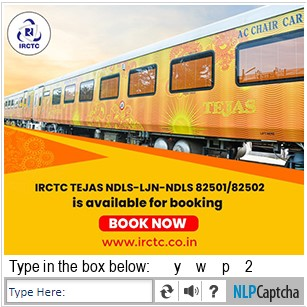
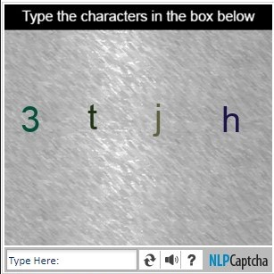
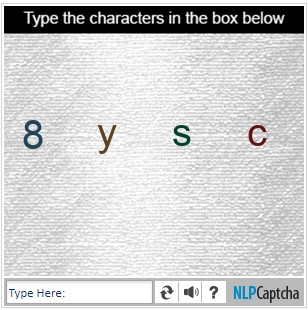
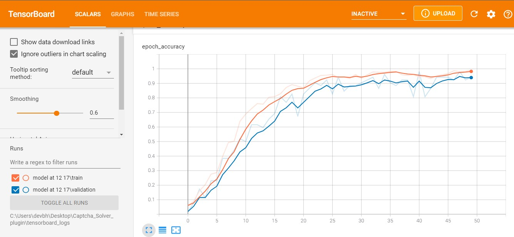
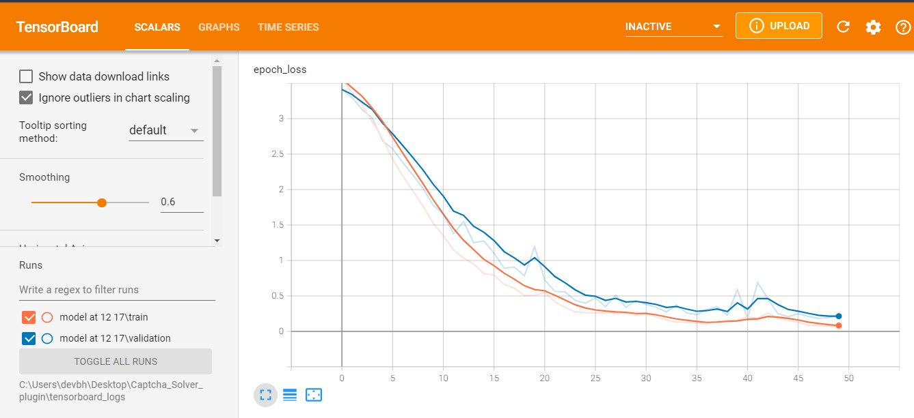
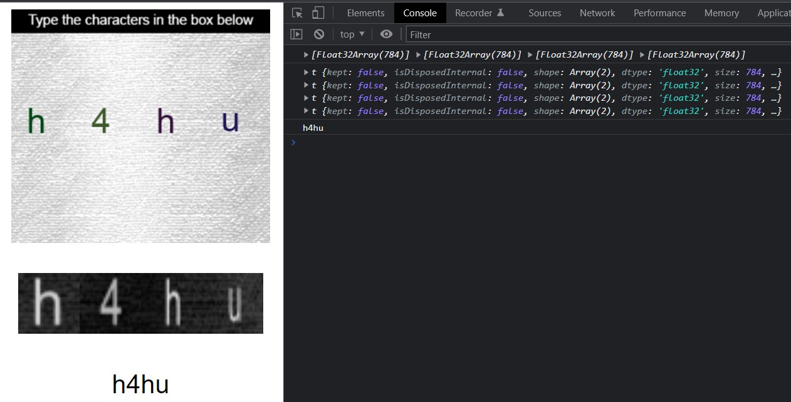
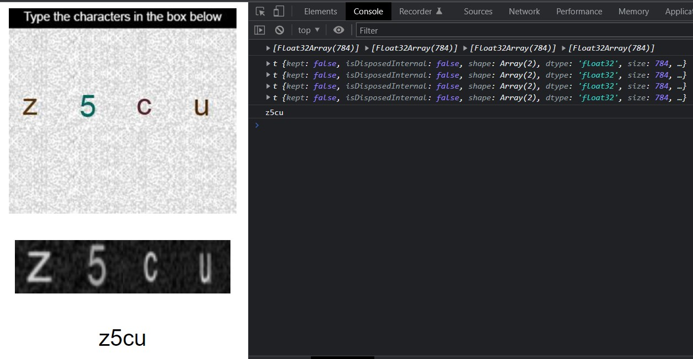
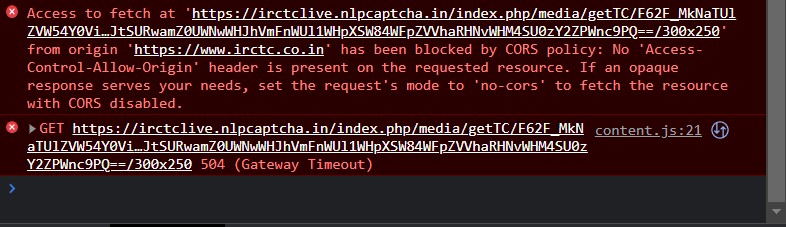

# IRCTC-nlpCaptcha-Solver

## Problem Statement
Make a Chrome extention that autofills the Captchas found on the IRCTC website.

## Method
Using CV and tensorflow to create an algorithm that can recognise the nlpCaptcha image and output the text, 
later converting it into an app using tensorflowjs and opencv so the it can be easily implemented into various web apps (e.g. chrome extension api .etc)

## Approach
The IRCTC website has its captcha service outsourced to Simpli5d Technologies' nlpCaptcha.
Thw way that the captcha woks that it initally shows a variety of differnt types of Captcha like text fill, image clicking ,etc.

### *Inital Captacha*

But once refreshed it subequntly follows the same captcha pattern of text filling for every refresh

### *Captacha pattern on reload*
 
 

So this could easily be tackled by mkaing the script.js and adding a click event to the button so that the captacha automatically gets refreshed once it loads. 

## Collecting Data to train the model
Initally I attemped to use the MINST 0-9 digits and A-Z handwritten lettes data-set in order to train the model but that accuracy of those ended up being less than 70%.
So I decided to make a comed data set of around 600 images from the MINST and arounf 600 from the captcha iself.
Since each captcha had 4 letters/digits in them I used opencv to separate each letter into a image of 28x28 pixels (As to keep them the same size of the MIST dataset)

## Building and Training the Model
I made a classic Multi-layer Perceptron neural network and traind using the keras.tensorflow library it with the data the accuracy on this was suprisingly great.

### *Accuracy : 96%*

### *Loss : 0.2*
 

## Converting the model to JavaSrcipt and building the app

Now that the model has been saved, I converted it into JavaScript using tensorflow-converter. After that I built an app that can take the image and sparate them into letters using OpenCV.js and then predicting the results through the Model and print out the text in the console and an HTML element [script.js](app/script.js)

### *App*
 
 

## Building the Chrome extension

The Chrome extention worked pretty well in the start as I was testing out the auto-ckick of the refrest button to get the same captcha and then filling out the from with some random words, etc.

## Issues

I stared to run across this issue when I try to retrive the image from the  tag, Up until now I had been saving the captcha image locally for testing it in the app and while testing my model. But, when I tried to make a request to GET the image from the Captcha's Server. It throws the following Error.

After doing a bit of searching I found out the the server that my app had been requesting the image had CORS (Cross-origin-resource-sharing) resticted so I was not allowing my app to fetch the image from the source. I tried mutliple ways of solving this but sill haven't found a work-around for this issue. [MDN - Access-Control-Allow-Origin](https://developer.mozilla.org/en-US/docs/Web/HTTP/Headers/Access-Control-Allow-Origin)

