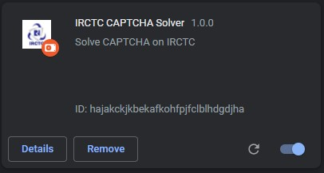

# IRCTC-nlpCaptcha-Solver

## Method
Using CV and tensorflow to create an algorithm that can recognise the nlpCaptcha image and output the text, 
later converting it into an app using tensorflow.js and opencv.js so the it can be easily implemented into various web apps (e.g. Chrome Extension api .etc).

Finding/Creating Dataset -> Data-Processing -> Building and Training the Model -> Converting it into js -> Building an app -> Converting it into a Chrome Extension.

## Tech Stack
* Python
* OpenCV
* Keras
* Tensorflow
* JavaScript
* HTML
* CSS

## Approach
The IRCTC website has its captcha service outsourced to [Simpli5d Technologies](https://nlpcaptcha.in/en/index.html) nlpCaptcha.
Thw way that the captcha woks that it initally shows a variety of differnt types of Captcha like text fill, image clicking ,etc.

### *Inital Captacha*

But once refreshed it subsequently follows the same captcha pattern of text filling on every refresh/reload.

### *Captacha pattern on reload*
 
 

So this could easily be tackled by adding a click event to the button so that the captacha automatically gets refreshed once it loads. 

## Collecting Data to train the model
Initally I attemped to use the MINST 0-9 digits and A-Z handwritten lettes data-set in order to train the model but that accuracy of those ended up being less than 70%.
So I decided to make a combined data-set from the MINST and taking a few from the captcha iself.
Since each captcha had 4 letters/digits in them I used opencv to separate each letter into a image of 28x28 pixels (As to keep them the same size of the MINST dataset).

### *Data-Set used*

## Building and Training the Model
Built a simple Multi-layer Perceptron neural network and traind it using the keras.tensorflow library it with the data the accuracy on this was suprisingly great.

### *Accuracy : 97%*

### *Loss : 0.05*
 

## Converting the model to JavaSrcipt and building the app

Now that the model has been saved, I converted it into JavaScript using tensorflow-converter. After that I built an app that can take the image and sparate them into letters using OpenCV.js and then predicting the results through the Model and print out the text in the console and an HTML element [script.js](app/script.js).

### *App*
 
 

## Building the Chrome extension
###

The Chrome extention worked pretty well initally as I was testing out the auto-ckick for the refrest button and then auto-filling the from with some random words, etc. But when I tried to fetch the image from the captcha I started to run into some issues.

## Issues

I stared to run across this issue when I try to retrive the image from the  tag, Up until now I had been saving the captcha image locally for testing it in the app and while testing my model. But, when I tried to make a request to GET the image from the Captcha's Server. It throws the following error:

After doing a some searching I found out the the server that my app had been requesting the image had CORS (Cross-origin-resource-sharing) resticted so It was not allowing my app to fetch the image from the source. [MDN - Access-Control-Allow-Origin](https://developer.mozilla.org/en-US/docs/Web/HTTP/Headers/Access-Control-Allow-Origin)

## Work-around

So, the only way I could solve this issue is that instead of requesting for the image again I just download the one that has already been requested bu the IRCTC server for the captcha. So when a captcha appreas on the screen a download of the image is inititated automatically and then the chrome api (the premission to chmore to acess local files need to be provided manually for this to work.) reads the image locally and then uses it to predict the text.

Obviously this leads to a really bad UX, but as of now this is the only solution to this issue that I could find.

## Conclusion

The extension does its job as intended the only pitfall to this is that the user needs to manullay give chrome access to read its files.

## Possible Improvements 

* Finding another way to store the image instead of storing it in the users local files (maybe chrome.storage).
* For now the extention only fills the captcha once and the model's accuracy being 97% it come times predicts a letter in the captcha wrong (can be fixed by improving the model's test accuracy).
