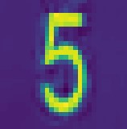
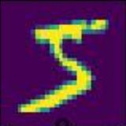

# IRCTC-nlpCaptcha-Solver

## Installing the Extension
### *Demo Video*
[How to install](https://drive.google.com/file/d/1S9zzamvuZC7ppujlaSXRSS6LkP5vnLx3/view?usp=sharing)

[extension.zip](https://drive.google.com/file/d/1OMjxvAXt6p9v7_eKz5GkVlG1PtfOkzuw/view?usp=sharing)

## Method
Using CV and tensorflow to create an algorithm that can recognise the nlpCaptcha image and output the text, 
later converting it into an app using tensorflow.js and opencv.js so the it can be easily implemented into various web apps (e.g. Chrome Extension api .etc).

Finding/Creating Dataset -> Data-Processing -> Building and Training the Model -> Converting it into js -> Building an app -> Converting it into a Chrome Extension.

## Tech Stack
* Python
* OpenCV
* Keras
* Tensorflow
* JavaScript
* HTML
* CSS

## Approach
The IRCTC website has its captcha service outsourced to [Simpli5d Technologies](https://nlpcaptcha.in/en/index.html) nlpCaptcha.
Thw way that the captcha woks that it initally shows a variety of differnt types of Captcha like text fill, image clicking ,etc.

### *Inital Captacha*

But once refreshed it subsequently follows the same captcha pattern of text filling on every refresh/reload.

### *Captacha pattern on reload*
 
 

So this could easily be tackled by adding a click event to the button so that the captacha automatically gets refreshed once it loads. 

## Collecting Data to train the model
Initally I attemped to use the MINST 0-9 digits and A-Z handwritten lettes data-set in order to train the model but that accuracy of those ended up being less than 70%.
So I decided to make a combined data-set from the MINST and taking a few from the captcha iself.
Since each captcha had 4 letters/digits in them I used opencv to separate each letter into a image of 28x28 pixels (As to keep them the same size of the MINST dataset).

### *Data-Set used*

## Building and Training the Model
Built a simple Multi-layer Perceptron neural network and traind it using the keras.tensorflow library it with the data the accuracy on this was suprisingly great.

### *Accuracy : 97%*

### *Loss : 0.05*
 

## Converting the model to JavaSrcipt and building the app

Now that the model has been saved, I converted it into JavaScript using tensorflow-converter. After that I built an app that can take the image and sparate them into letters using OpenCV.js and then predicting the results through the Model and print out the text in the console and an HTML element [script.js](app/script.js).

### *App*
 
 

## The Chrome extension

### *Chrome extention*

## Conclusion

The extention works as intended within 1-1.5 seconds the captcha autofills with the text.

## Possible Improvements 

* For now the extention only fills the captcha once and the page need to be reloaded to fill it again. Also model's accuracy being 97% it sometimes predicts a letter in the captcha wrong (can be fixed by improving the model's test accuracy).
